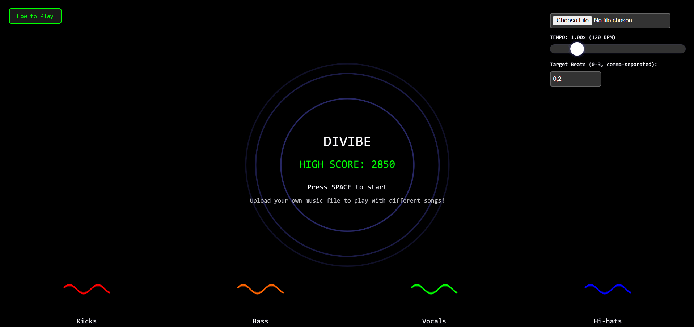

# DIVIBE 🎵

A rhythm-based typing game where you sync your keystrokes with the music. Feel the beat, type the letters, and become one with the rhythm!

## 🎮 How to Play

1. **Start the Game**

   - Press SPACE to begin
   - Watch for letters appearing on screen
   - Press both letters simultaneously on the target beats

2. **Controls**

   - **Left Hand**: A, S, D, F, Q, W, E, Z, X, C
   - **Right Hand**: J, K, L, ;, U, I, O, P, N, M
   - **SPACE**: Start/Pause the game

3. **Scoring**
   - Perfect sync on target beats: 50 points
   - Perfect timing: 100 points
   - Miss 4 beats in a row: -10 points

## 🎛️ Features

### Music Control

- Upload your own music files
- Adjust tempo (0.5x - 3x)
- Real-time audio visualization
- Automatic BPM detection

### Gameplay Customization

- Target beat selection (0-3)
- Visual feedback for timing
- Score tracking and high scores
- Beautiful audio-reactive visualizations

### Visual Effects

- Dynamic frequency visualization
- Beat indicators
- Ambient background effects
- Responsive design

## 🛠️ Technical Details

Built with:

- p5.js for graphics and audio
- music-tempo for BPM detection

## 🚀 Getting Started

1. Clone the repository
2. Open `index.html` in a modern web browser
3. Upload your music or use the default track
4. Press SPACE to start playing

## 💡 Tips

- Start with tracks that have a clear, steady beat
- Use the tempo control to find your comfort zone
- Watch the beat indicators to stay in rhythm
- Try different target beat patterns for variety

## 📝 License

MIT License - feel free to use, modify, and share!

## 👨‍💻 Author

Created by [@ye_we](https://t.me/ye_we)

---

Made with ❤️ by a house music ❤️er
